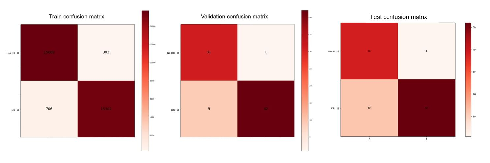
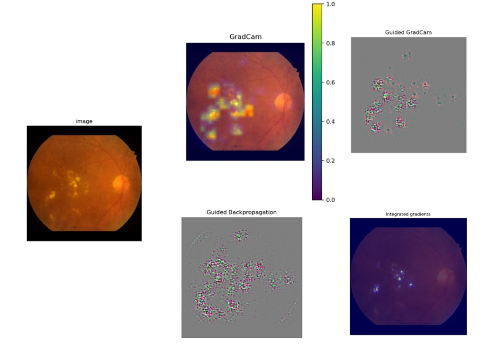
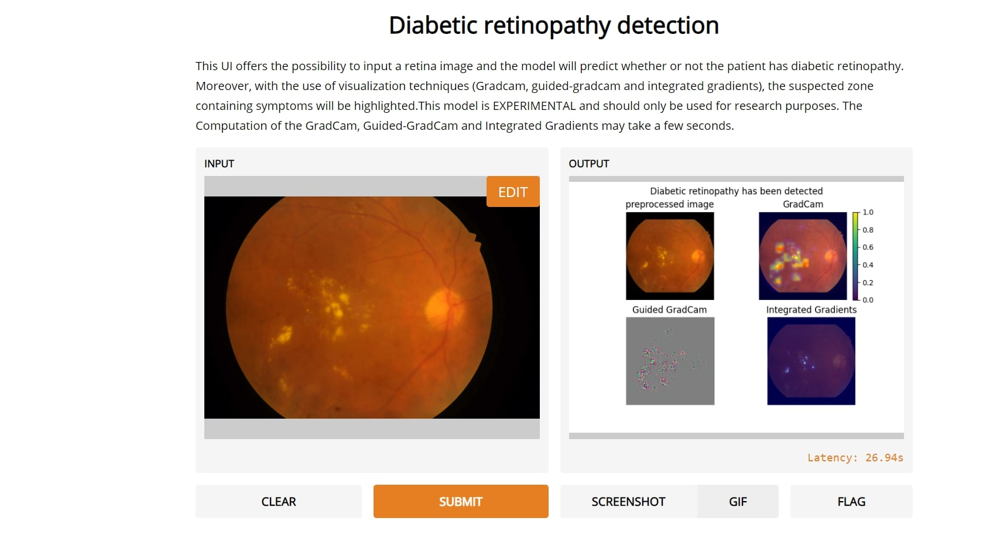
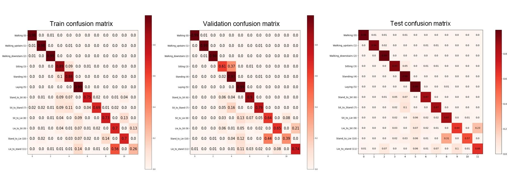
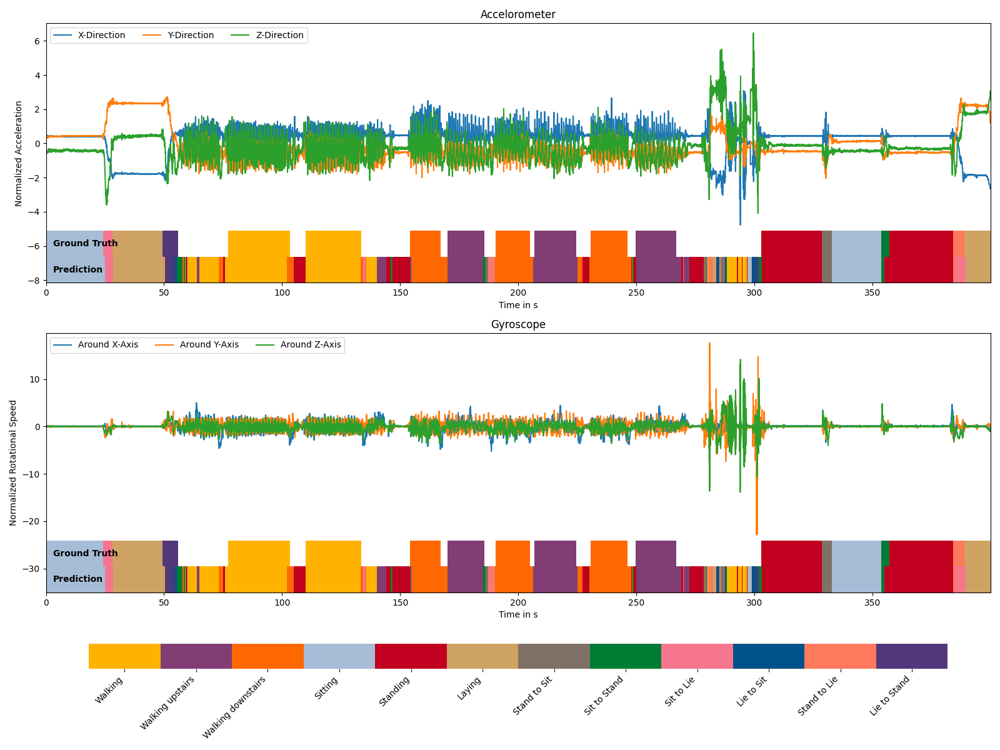

# Team04
- Florian Bender (st144129)
- Hamza Ben Haj Ammar (st151070)

# Diabetic Retinopathy

## How to run the code

### Training
Set the desired configuration inside [`config.gin`](diabetic_retinopathy/configs/config.gin) and run [`main.py`](diabetic_retinopathy/main.py) without any command line arguments to start training a new model from scratch.
Configurable parameters include the type of model, the dataset to train it on, how long to train, how/whether to cache the dataset and which data augmentation methods to use. Transfer Learning using pretrained model from tf-hub is also supported. In order to use it, simply set the model type to the link of the desired model.   
A new run will be saved inside a new run folder in the directory `experiments`. It will contain the configuration which was used for this run, a folder with the saved checkpoints, and a folder with logs, including tensorboard logs for train and test performance.  
The folder name will be of the format `run_<date-of-creation>`. If you want to be able to identify a run more easily, you can add a custom name as a suffix to the folder name by adding the command line argument `--name <name>`, resulting in a folder name in the format `run_<date-of-creation>_<name>`.  
  
### Evaluation
Once a run has finished, you can evaluate the trained model's performance on the test set by using the command line argument `--evaluate_from <run-folder-or-checkpoint>`. Substitute 
`<run-folder-or-checkpoint>` either with the run folder of the finished run to evaluate the latest checkpoint, or with the path to the exact checkpoint (`<run-folder>/ckpts/ckpt-n` for n-th checkpoint) which you want to evaluate on the test set.  

### Continuing training
If you want to continue training the model of a finished run, you can do so by using `--continue_training_from <run-folder-or-checkpoint>`. Just like with evaluation, you can specify the folder or the exact checkpoint from which to continue.  
By default, the continued run will reuse it's configuration file saved in the run folder. If you really want to change something about the configuration though, you can use the command line arguemnt `--force_use_config` to use the configuration currently set in [`config.gin`](diabetic_retinopathy/configs/config.gin) instead. Note that changes to the architecture will lead to undesirable results or exceptions, since the checkpoint to be loaded is dependent on it.  
If you want to fine tune the trained model, use `--fine_tune`. This will reduce the learning rate by the factor 100, and in case of a tf-hub model it will also unfreeze the base network.  
  
The command line argument `--helpshort` will give a quick overview over the all these arguments.

### Hyperparameter optimization  
[`tune.py`](diabetic_retinopathy/tune.py) performs hyperparameter optimization. The hyperparameters being optimized are the following: 
- `Architecture.base_filters`
- `Architecture.n_blocks`
- `Architecture.dense_units`
- `Architecture.dropout_rate`
- `augment.min_cropping_size`
- `augment.max_cropping_size`
- `augment.cropping_probability`
- `augment.brightness_max_delta`
- `augment.contrast_min_factor`
- `augment.hue_max_delta`
- `augment.saturation_min_factor`

[//]: # (end of list)
`Architecture.model_type` will by default be set to `@CNN_block`.
The rest of the configuration is still taken from [`config.gin`](diabetic_retinopathy/configs/config.gin).  
The following command line arguments can be used to change `tune.py`'s behaviour:
- `--metric <metric>` - Which metric to optimize for - `val_accuracy` (default) or `val_loss`.
- `--name <name>` - A custom name for this hyperparameter optimization run, similar to `--name` of `main.py`
- `--num_samples <n>` - The number of runs to be done before optimization is stopped.
- `--search_alg <search_alg>` - Which search algorithm to use - `random_search` (default), `hyperopt`, or `bayesopt`.
- `--restore_from <ckpt-path>` - To restore the state of the search algorithm from a previously saved checkpoint. (Only works for `hyperopt` or `bayesopt`)
- `--transfer_learning` - To use a selection of pretrained model from tf-hub using trasfer learning for hyperparameter optimization. If this is specified, `Architecture.base_filters`, `Architecture.n_blocks`, and `Architecture.dense_units` aren't used and instead, `Architecture.model_type` will be optimized between one of three preselected tf-hub models.

[//]: # (end of list)
Again, `--helpshort` shows a summary of those arguments.

__Important:  
The string `'/absolute/path/to/diabetic_retinopathy/'` in line 57 and line 169 needs to be replaced with the absolute path to the the directory [`diabetic_retinopathy`](diabetic_retinopathy) before [`tune.py`](diabetic_retinopathy/tune.py) is run. Also, if you want the run folders of the runs done for hyperparamter optimization to have a custom name, you have to manually edit the string `'by-tune'` in line 52.__

### Visualization
A trained model can be visualized via the Grad-CAM or Integrated Gradients method using [`visualization.py`](diabetic_retinopathy/visualization.py). A run folder or checkpoint to load the model from must be specified using `--visualize_from <run-folder-or-checkpoint>`. The visualization method (`gradcam` or `integrated_gradients`) can be chosen via the argument `--mode <mode>`. If you want to visualize the model on a specific image, you can specify it with `--image_path <path>`, otherwise N random images from the test set will be visualized, where N can be defined via `--num_images <N>`. If you do specify an image path, please also specify the number of classes the model is built to distinguish using `--num_classes <n>`, as loading the dataset is then skipped, so the number of classes can't be inferred from it.  
Example with our best model:
```
python3 ./diabetic_retinopathy/visualization.py --visualize_from ./diabetic_retinopathy/best_model/run_2020-12-25T09-53-02-345803/ckpts/ckpt-2
```

## Results
The run folder of our best diabetic retinopathy detection model can be found in [`best_model/`](diabetic_retinopathy/best_model/). Loading from it's second checkpoint, it achieves an accuracy of ~87%, and a balanced accuracy of ~89% on the test set. It does so with a high precision of ~98% and a comparatively low recall of ~81%.
These results can be easily reproduced by running
```
python3 ./diabetic_retinopathy/main.py --evaluate_from ./diabetic_retinopathy/best_model/run_2020-12-25T09-53-02-345803/ckpts/ckpt-2
``` 
Its hyperparameters were found using Bayesian Optimization. They can be found in [`config_operative.gin`](diabetic_retinopathy/best_model/run_2020-12-25T09-53-02-345803/config_operative.gin).

For the remaining metrics, please refer to this table:
| Metrics | Train set | Validation set | Test set | 
|:------:|:------:|:------:|:------:|
|Accuracy| 96% | 90% | 87% |
|Precision| 98% | 98% | 98% |
|Recall| 95% | 96% | 81% |
|F1 score|  98% | 98% | 89% |
|Balaned Accuracy| 96% | 92% | 89% |

### Confusion matrices
The confusion matrices for the train, validation and test datasets look as follow:



### Visualization 
For the best model and an example input image, the following Gradcam, Guided backpopagation, Guided-Gradcam and Integrated gradient images were obtained:



To visualize a certain visualization technique, one could use the visualization script as mentioned in the section 'How to run the code/Visualization' or use a developed 
user interface where for a given image, the UI will show whether diabetic retinopathy has been detected or not and highlight the suspected zone.

During the month of February a global link is available at:
https://gradio.app/g/hamzabha/Diabetic-Retinopathy

Starting March 1st, `Deployment.py` has to be run and a local link can then be followed to access the user-interface. Note that this requires gradio to be installed (`pip install gradio`).
The UI works best with Google Chrome.

 

# Human Activity Recognition

## How to run the code

### Training
Set the desired configuration inside [`config.gin`](HAPT/configs/config.gin) and run [`main.py`](HAPT/main.py) without any command line arguments to start training a new model from scratch.
Configurable parameters include model hyperparameters, windowing parameters in the input pipeline and how long to train.
A new run will be saved inside a new run folder in the directory `HAPT_experiments`. It will contain the configuration which was used for this run, a folder with the saved checkpoints, and a folder with logs, including tensorboard logs for train and test performance.  
The folder name will be of the format `run_<date-of-creation>`. If you want to be able to identify a run more easily, you can add a custom name as a suffix to the folder name by adding the command line argument `--name <name>`, resulting in a folder name in the format `run_<date-of-creation>_<name>`.  

### Evaluation
Once a run has finished, you can evaluate the trained model's performance on the test set by using the command line argument `--evaluate_from <run-folder-or-checkpoint>`. Substitute 
`<run-folder-or-checkpoint>` either with the run folder of the finished run to evaluate the latest checkpoint, or with the path to the exact checkpoint (`<run-folder>/ckpts/ckpt-n` for n-th checkpoint) which you want to evaluate on the test set.  

### Continuing Training
If you want to continue training the model of a finished run, you can do so by using `--continue_training_from <run-folder-or-checkpoint>`. Just like with evaluation, you can specify the folder or the exact checkpoint from which to continue.  
By default, the continued run will reuse it's configuration file saved in the run folder. If you really want to change something about the configuration though, you can use the command line arguemnt `--force_use_config` to use the configuration currently set in [`config.gin`](HAPT/configs/config.gin) instead. Note that changes to the architecture will lead to undesirable results or exceptions, since the checkpoint to be loaded is dependent on it.  
If you want to fine tune the trained model, use `--fine_tune`. This will reduce the learning rate by the factor 100.  
  
The command line argument `--helpshort` will give a quick overview over the all these arguments.

### Hyperparameter optimization  
[`tune.py`](HAPT/tune.py) performs hyperparameter optimization. The hyperparameters being optimized are the following: 
- `Architecture.rnn_block_type`
- `Architecture.rnn_units`
- `Architecture.num_rnn_layers`
- `Architecture.dense_units`
- `Architecture.dropout_rate`

[//]: # (end of list)
The rest of the configuration is still taken from [`config.gin`](HAPT/configs/config.gin).  
The following command line arguments can be used to change `tune.py`'s behaviour:
- `--metric <metric>` - Which metric to optimize for - `val_accuracy` (default) or `val_loss`.
- `--name <name>` - A custom name for this hyperparameter optimization run, similar to `--name` of `main.py`
- `--num_samples <n>` - The number of runs to be done before optimization is stopped.
- `--search_alg <search_alg>` - Which search algorithm to use - `random_search` (default), `hyperopt`, or `bayesopt`.
- `--restore_from <ckpt-path>` - To restore the state of the search algorithm from a previously saved checkpoint. (Only works for `hyperopt` or `bayesopt`)

[//]: # (end of list)
Again, `--helpshort` shows a summary of those arguments.

__Important:  
The string `'/absolute/path/to/HAPT/'` in line 50 and line 120 needs to be replaced with the absolute path to the the directory [`HAPT`](HAPT) before [`tune.py`](HAPT/tune.py) is run. Also, if you want the run folders of the runs done for hyperparamter optimization to have a custom name, you have to manually edit the string `'by-tune'` in line 45.__

### Visualization
The predictions of a trained model can be visualized using [`visualization.py`](HAPT/visualization.py). A run folder or checkpoint to load the model from must be specified using `--visualize_from <run-folder-or-checkpoint>`. The resulting image shows a random consecutive series of data points from the test set with a length of 400s (20.000 samples), with acceleration and gyroscope data in separate figures. In the bottom of each figure, there are two color coded bars representing ground truth and prediction of the model, respectively. White areas in the ground truth represent unlabelled data, all other colors are explained in a legend at the bottom of the image.  
Example with our best model:
```
python3 ./HAPT/visualization.py --visualize_from ./HAPT/best_model/run_2021-02-09T11-16-48-692518/
```


## Results
The run folder of our best human activity recognition model can be found in [`best_model/`](HAPT/best_model/). All checkpoints except for the best one (ckpt-10) were removed to reduce file size. It achieves an accuracy of ~95%, and a balanced accuracy of ~86% on the test set.
These results can be easily reproduced by running
```
python3 ./HAPT/main.py --evaluate_from ./HAPT/best_model/run_2021-02-09T11-16-48-692518/
```  
Its hyperparameters were found using Bayesian Optimization. They can be found in [`config_operative.gin`](HAPT/best_model/run_2021-02-09T11-16-48-692518//config_operative.gin).

For the remaining metrics, please refer to this table:
| Activity | Recall | Precision | F1-score | 
|:------:|:------:|:------:|:------:|
|Walking| 97.8% | 99.7% | 98.8% |
|Walking Upstairs| 94.5% | 99.0% | 96.7% |
|Walking Downstairs| 99.3% | 95.2% | 97.5% |
|Sitting|  92.9% | 98.6% | 95.7% |
|Standing| 98.8% | 93.5% | 96.1% |
|Laying| 98.7% | 92% | 98.4% |
|Stand to Sit| 87.5% | 70.3% | 77.9% |
|Sit to Stand| 87.3% | 61.2% | 72.0% |
|Sit to Lie| 86.7% | 63.2% | 73.1% |
|Lie to Sit| 63.8% | 79.9% | 71.0% |
|Stand to Lie| 56.7% | 86.8% | 68.6% |
|Lie to Stand| 65.8% | 71.2% | 68.4% |

### Confusion matrices
The confusion matrices for the train, validation and test datasets look as follow:



### Visualization 
For the best model and a random sequence of data, using the visualization script, the following image is generated:

